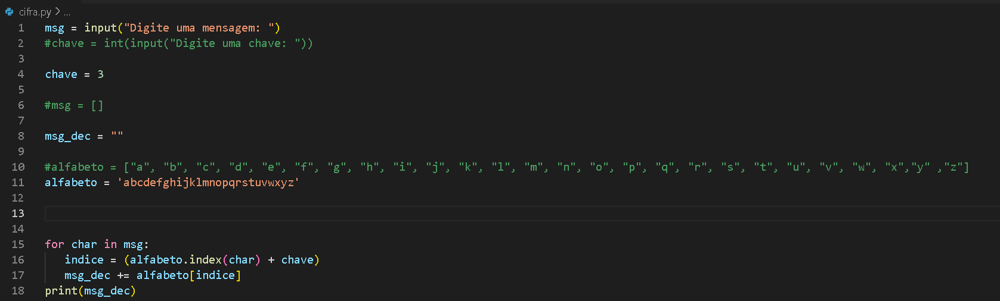

<h1> Cadastro de usuários </h1>


<h1> Cifra de César </h1>



<h1> Senha </h1>

```
# algoritmo senha


password = int(input("Digite a senha (0 a 10): ")) # usuário digita a senha
tent = 0


while password != 9:
    print("Senha errada!")
    password = int(input("Digite a senha novamente: "))
    tent += 1

tent += 1

print("SENHA CORRRETA!")
print(tent, "Tentativas")
```
