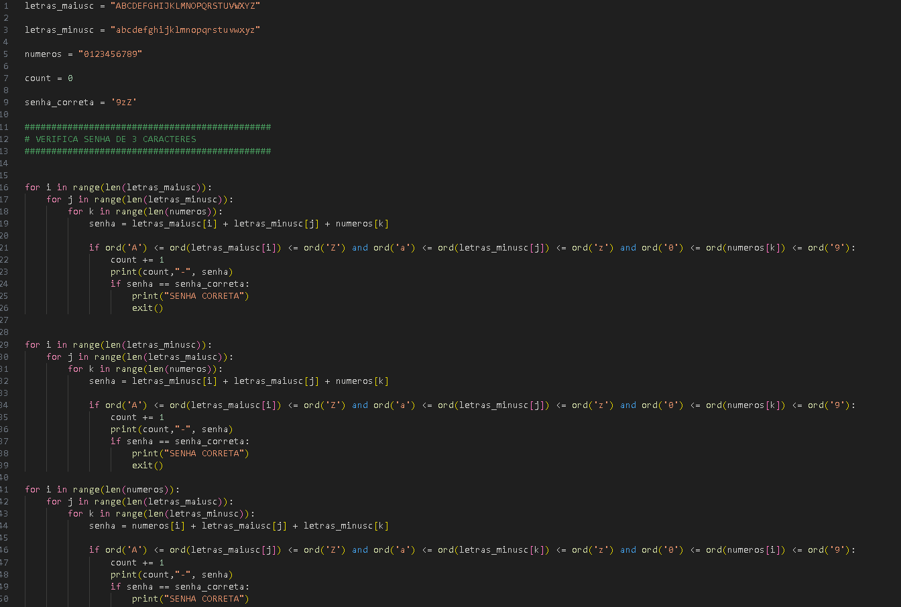
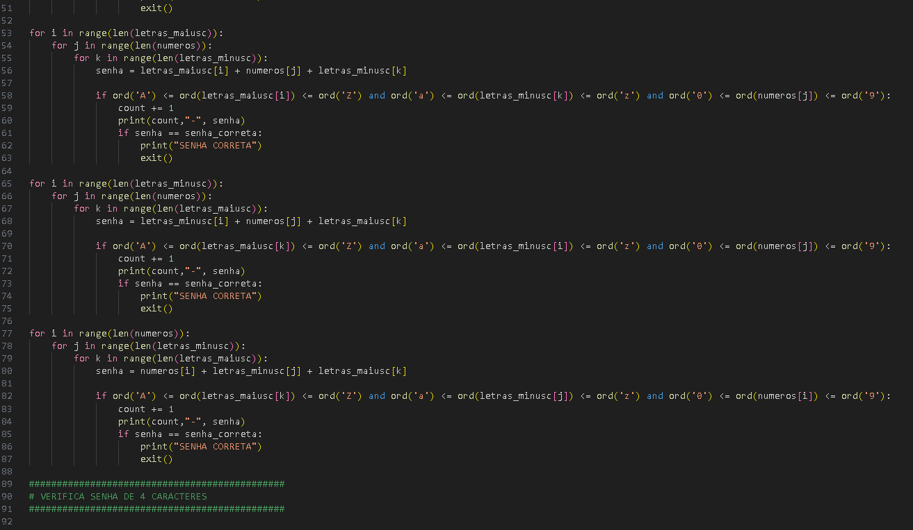

SENHA TESTE

''''
    
    letras_maiusc = "ABCDEFGHIJKLMNOPQRSTUVWXYZ"

    letras_minusc = "abcdefghijklmnopqrstuvwxyz"

    numeros = "0123456789"

    count = 0

    senha_correta = '9zZ'

    ##############################################
    # VERIFICA SENHA DE 3 CARACTERES
    ##############################################
        
        
    for i in range(len(letras_maiusc)):
        for j in range(len(letras_minusc)):
            for k in range(len(numeros)):
                senha = letras_maiusc[i] + letras_minusc[j] + numeros[k]

                if ord('A') <= ord(letras_maiusc[i]) <= ord('Z') and ord('a') <= ord(letras_minusc[j]) <= ord('z') and ord('0') <= ord(numeros[k]) <= ord('9'):
                    count += 1
                    print(count,"-", senha)
                    if senha == senha_correta:
                        print("SENHA CORRETA")
                        exit()

    for i in range(len(letras_minusc)):
        for j in range(len(letras_maiusc)):
            for k in range(len(numeros)):
                senha = letras_minusc[i] + letras_maiusc[j] + numeros[k]
                
                if ord('A') <= ord(letras_maiusc[i]) <= ord('Z') and ord('a') <= ord(letras_minusc[j]) <= ord('z') and ord('0') <= ord(numeros[k]) <= ord('9'):
                    count += 1
                    print(count,"-", senha)
                    if senha == senha_correta:
                        print("SENHA CORRETA")
                        exit()

    for i in range(len(numeros)):
        for j in range(len(letras_maiusc)):
            for k in range(len(letras_minusc)):
                senha = numeros[i] + letras_maiusc[j] + letras_minusc[k]

                if ord('A') <= ord(letras_maiusc[j]) <= ord('Z') and ord('a') <= ord(letras_minusc[k]) <= ord('z') and ord('0') <= ord(numeros[i]) <= ord('9'):
                    count += 1
                    print(count,"-", senha)
                    if senha == senha_correta:
                        print("SENHA CORRETA")
                        exit()

    for i in range(len(letras_maiusc)):
        for j in range(len(numeros)):
            for k in range(len(letras_minusc)):
                senha = letras_maiusc[i] + numeros[j] + letras_minusc[k]

                if ord('A') <= ord(letras_maiusc[i]) <= ord('Z') and ord('a') <= ord(letras_minusc[k]) <= ord('z') and ord('0') <= ord(numeros[j]) <= ord('9'):
                    count += 1
                    print(count,"-", senha)
                    if senha == senha_correta:
                        print("SENHA CORRETA")
                        exit()

    for i in range(len(letras_minusc)):
        for j in range(len(numeros)):
            for k in range(len(letras_maiusc)):
                senha = letras_minusc[i] + numeros[j] + letras_maiusc[k]

                if ord('A') <= ord(letras_maiusc[k]) <= ord('Z') and ord('a') <= ord(letras_minusc[i]) <= ord('z') and ord('0') <= ord(numeros[j]) <= ord('9'):
                    count += 1
                    print(count,"-", senha)
                    if senha == senha_correta:
                        print("SENHA CORRETA")
                        exit()

    for i in range(len(numeros)):
        for j in range(len(letras_minusc)):
            for k in range(len(letras_maiusc)):
                senha = numeros[i] + letras_minusc[j] + letras_maiusc[k]

                if ord('A') <= ord(letras_maiusc[k]) <= ord('Z') and ord('a') <= ord(letras_minusc[j]) <= ord('z') and ord('0') <= ord(numeros[i]) <= ord('9'):
                    count += 1
                    print(count,"-", senha)                       
                    if senha == senha_correta:
                        print("SENHA CORRETA")
                        exit()

    ##############################################
    # VERIFICA SENHA DE 4 CARACTERES
    ##############################################
''''

